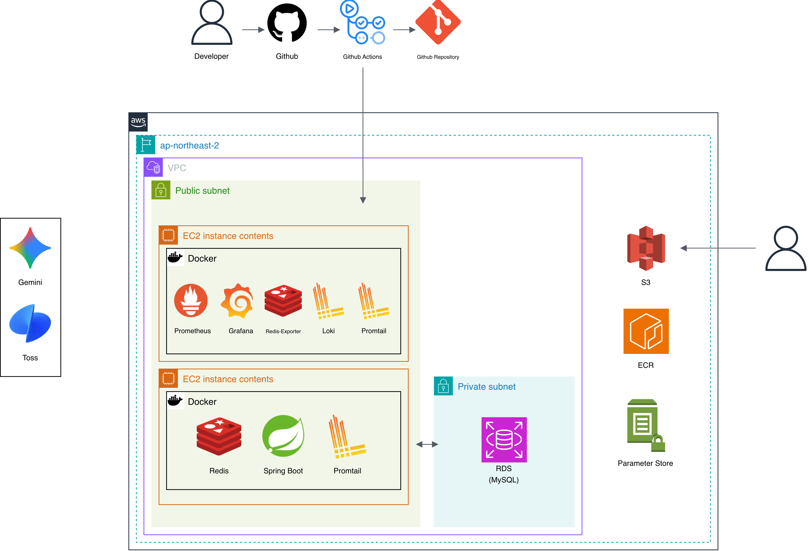
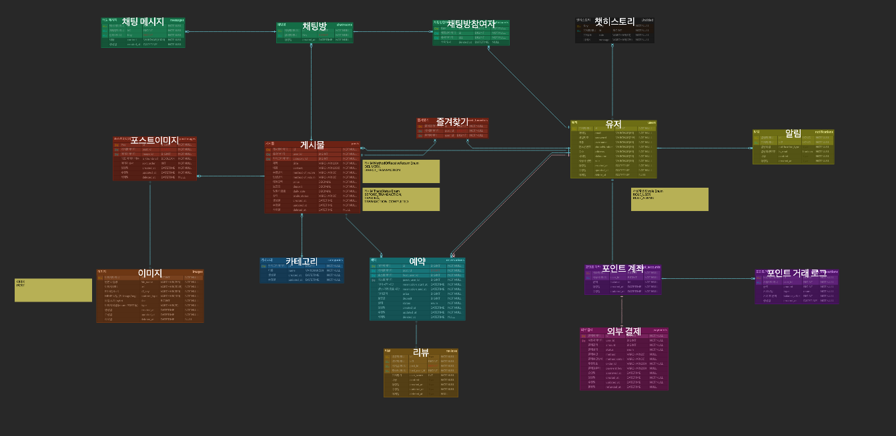

# ⛳ GolfRental - 골프 장비 P2P 대여 플랫폼

실시간 채팅, AI 챗봇, 스마트 알림 시스템을 갖춘 현대적인 골프 장비 렌탈 서비스

## 목차

- [1. 팀원 소개](#1-팀원-소개)
- [2. 프로젝트 개요](#2-프로젝트-개요)
- [3. 주요 기술 스택](#3-주요-기술-스택)
- [4. 서비스 플로우](#4-서비스-플로우)
- [5. 아키텍처](#5-아키텍처)
- [6. ERD](#6-erd)
- [7. API 명세](#7-api-명세)
- [8. 기술적 의사결정](#8-기술적-의사결정)
- [9. 트러블 슈팅 & 최적화 전략](#9-트러블-슈팅--최적화-전략)
- [10. 주요 기능](#10-주요-기능)
- [11. 시작하기](#11-시작하기)
- [12. 프로젝트 구조](#12-프로젝트-구조)
- [13. 연락처](#13-연락처)

## 1. 팀원 소개

<div align="center">
  <table>
    <tbody>
      <tr>
        <td align="center" style="padding: 20px;">
          <div style="margin-top: 10px; font-size: 14px; line-height: 1.2;">
            <b>팀장</b><br />
            <a href="https://github.com/hyuncles" style="font-size: 16px;">윤석호</a>
            <div style="margin-top: 5px; font-size: 14px;">
              알림<br />채팅<br />챗봇<br />리뷰
            </div>
          </div>
        </td>
        <td align="center" style="padding: 20px;">
          <div style="margin-top: 10px; font-size: 14px; line-height: 1.2;">
            <b>팀원</b><br />
            <a href="https://github.com/AllSungho" style="font-size: 16px;">이성호</a>
            <div style="margin-top: 5px; font-size: 14px;">
              유저<br />포스트<br />이미지
            </div>
          </div>
        </td>
        <td align="center" style="padding: 20px;">
          <div style="margin-top: 10px; font-size: 14px; line-height: 1.2;">
            <b>팀원</b><br />
            <a href="https://github.com/zerone1202" style="font-size: 16px;">박소영</a>
            <div style="margin-top: 5px; font-size: 14px;">
              예약<br />결제<br />카테고리
            </div>
          </div>
        </td>
      </tr>
    </tbody>
  </table>
</div>

## 2. 프로젝트 개요

**개발 기간:** 2024.11 ~ 2024.12

`GolfRental`은 골프 장비를 빌리고 대여하는 P2P 플랫폼입니다. 사용자 간 직거래를 지원하며, 실시간 채팅, AI 기반 챗봇, 스마트 알림 시스템을 통해 최상의 사용자 경험을 제공합니다.

- **프론트엔드**: [https://golfrental-sepia.vercel.app](https://golfrental-sepia.vercel.app)
- **백엔드 API**: http://dev.golfrental.com
- **API 문서**: http://dev.golfrental.com/swagger-ui/index.html

<br>

## 3. 주요 기술 스택

<div align="center">

### **애플리케이션**

   

### **인증 및 보안**

 

### **메시징 및 실시간 통신**

 

### **데이터베이스 & 캐시**

  

### **AI & ML**

  

### **클라우드 & 인프라**

   

### **CI/CD & 모니터링**

  

### **결제**


### **협업 도구**

   

</div>

<br>

## 4. 서비스 플로우

### [골프 장비 대여 프로세스]

1. **물품 등록**
   판매자가 대여할 골프 장비를 등록하고 가격과 대여 기간을 설정합니다.

2. **장비 검색 및 예약**
   사용자는 원하는 골프 장비를 검색하고 예약 신청을 합니다.

3. **실시간 채팅**
   판매자와 구매자는 WebSocket 기반 실시간 채팅으로 소통합니다.

4. **결제 및 확정**
   Toss Payments를 통해 결제하고 예약이 확정됩니다.

5. **리뷰 작성**
   대여 완료 후 리뷰를 작성하여 다른 사용자들에게 정보를 공유합니다.

<br>

### [AI 챗봇 플로우]

```
[사용자 질문]
    ↓
[Embedding Model (All-MiniLM-L6-v2)]
    ↓ 벡터 변환
[Redis Vector Store]
    ↓ 유사도 검색 (Top-5, 코사인 유사도 0.8 이상)
[RAG Context 생성]
    ↓
[Google Gemini 2.0 Flash]
    ↓ Chat Memory 활용 (최근 20개 메시지)
[답변 생성 및 반환]
```

<br>

## 5. 아키텍처

<div align="center">
  
</div>

### 주요 아키텍처 특징

- **실시간 통신**: WebSocket과 SSE를 통한 양방향/단방향 통신
- **Redis Pub/Sub**: 멀티 서버 환경에서 메시지 브로드캐스트
- **분산 락**: Redisson을 활용한 동시성 제어
- **AI 통합**: LangChain4j + Google Gemini API
- **벡터 검색**: Redis Vector Store (RediSearch)

<br>

## 6. ERD

<div align="center">
  
</div>

<br>

## 7. API 명세

자세한 API 문서는 [Swagger UI](http://dev.golfrental.com/swagger-ui/index.html)에서 확인할 수 있습니다.

### 주요 API 엔드포인트

#### 인증 (Auth)

- `POST /api/v1/auth/signup` - 회원가입
- `POST /api/v1/auth/login` - 로그인
- `POST /api/v1/auth/refresh` - 토큰 갱신

#### 게시글 (Post)

- `GET /api/v1/posts` - 게시글 목록 조회
- `GET /api/v1/posts/{id}` - 게시글 상세 조회
- `POST /api/v1/posts` - 게시글 생성
- `PUT /api/v1/posts/{id}` - 게시글 수정
- `DELETE /api/v1/posts/{id}` - 게시글 삭제

#### 예약 (Reservation)

- `GET /api/v1/reservations` - 예약 목록 조회
- `POST /api/v1/reservations` - 예약 생성
- `PATCH /api/v1/reservations/{id}/status` - 예약 상태 변경

#### 채팅 (Chat)

- `GET /api/v1/chatrooms` - 채팅방 목록
- `GET /api/v1/chatrooms/{id}` - 채팅방 상세
- `POST /api/v1/chatrooms` - 채팅방 생성
- `WebSocket /ws/chat/{chatRoomId}` - 실시간 채팅

#### 알림 (Notification)

- `GET /api/v1/notifications/subscribe` - SSE 구독
- `GET /api/v1/notifications` - 알림 목록
- `PATCH /api/v1/notifications/{id}/read` - 읽음 처리

#### AI 챗봇 (Chatbot)

- `POST /api/v1/chatbot/chat` - AI 챗봇 대화

<br>

## 8. 기술적 의사결정

### 1. 실시간 통신: WebSocket vs SSE

#### 📌 선택: WebSocket + SSE 병행 사용

| 비교 항목      | WebSocket         | SSE                   |
|------------|-------------------|-----------------------|
| **통신 방향**  | 양방향 (Full-Duplex) | 단방향 (Server → Client) |
| **사용 사례**  | 실시간 채팅            | 실시간 알림                |
| **연결 유지**  | 지속적 연결            | 자동 재연결                |
| **구현 복잡도** | 높음                | 낮음                    |

#### 💡 의사결정 근거

- **WebSocket (채팅)**: 사용자 간 양방향 메시지 교환이 필요한 채팅 기능에 적합
- **SSE (알림)**: 서버에서 클라이언트로의 단방향 푸시만 필요한 알림 기능에 적합
- HTTP/2 호환성과 자동 재연결 기능으로 안정적인 알림 전송 가능

### 2. AI 챗봇: LangChain4j + Google Gemini

#### 📌 선택: LangChain4j + Google Gemini 2.0 Flash

| 비교 항목       | LangChain4j + Gemini | OpenAI GPT-4    |
|-------------|----------------------|-----------------|
| **가격**      | 무료 (초기)              | 유료              |
| **응답 속도**   | 빠름 (Flash 모델)        | 보통              |
| **한국어 지원**  | 우수                   | 우수              |
| **Java 통합** | LangChain4j 네이티브     | OpenAI Java SDK |

#### 💡 의사결정 근거

- **LangChain4j**: Java 프로젝트와의 완벽한 통합, RAG 구현 용이
- **Google Gemini**: 빠른 응답 속도와 무료 tier, 우수한 한국어 지원
- **Tool Description**: LangChain4j의 Tool 추상화로 정확한 함수 호출 가능

### 3. 벡터 DB: Redis Vector Store

#### 📌 선택: Redis Vector Store (RediSearch)

| 비교 항목         | Redis Vector Store | Pinecone | Milvus      |
|---------------|--------------------|----------|-------------|
| **추가 비용**     | 없음 (기존 Redis 활용)   | 유료       | 무료 (셀프 호스팅) |
| **응답 속도**     | 매우 빠름 (<1ms)       | 빠름       | 보통          |
| **운영 복잡도**    | 낮음                 | 낮음       | 높음          |
| **기존 인프라 활용** | ✅                  | ❌        | ❌           |

#### 💡 의사결정 근거

- **기존 Redis 인프라 활용**: 추가 비용 없이 벡터 검색 구현
- **빠른 응답 속도**: 인메모리 기반으로 <1ms 지연시간
- **운영 단순화**: 별도 벡터 DB 관리 불필요
- **RediSearch 모듈**: 코사인 유사도 검색 지원

### 4. 분산 락: Redisson

#### 📌 선택: Redisson 분산 락

| 비교 항목          | Redisson | Lettuce (SetNX) | Database Lock |
|----------------|----------|-----------------|---------------|
| **구현 복잡도**     | 낮음       | 중간              | 낮음            |
| **성능**         | 우수       | 우수              | 보통            |
| **Pub/Sub 방식** | ✅        | ❌               | ❌             |
| **자동 해제**      | ✅        | ❌               | ✅             |

#### 💡 의사결정 근거

- **Pub/Sub 방식**: 폴링 없이 효율적인 락 획득
- **자동 해제**: Lease Time 설정으로 데드락 방지
- **멀티 서버 지원**: 분산 환경에서 안정적인 동시성 제어
- **CPU 효율성**: 폴링 대비 CPU 사용량 최소화

### 5. 메시지 브로커: Redis Pub/Sub

#### 📌 선택: Redis Pub/Sub

| 비교 항목      | Redis Pub/Sub | RabbitMQ      | Kafka        |
|------------|---------------|---------------|--------------|
| **메시지 보장** | At-most-once  | At-least-once | Exactly-once |
| **응답 속도**  | 매우 빠름 (<1ms)  | 빠름            | 보통           |
| **운영 복잡도** | 낮음            | 중간            | 높음           |
| **사용 사례**  | 실시간 알림/채팅     | 작업 큐          | 대용량 스트리밍     |

#### 💡 의사결정 근거

- **실시간 통신**: <1ms 지연시간으로 실시간 알림/채팅에 적합
- **기존 인프라 활용**: Redis 추가 설치 불필요
- **단순한 사용 사례**: 메시지 영속성이 필수가 아닌 실시간 통신
- **멀티 서버 동기화**: 서버 간 메시지 브로드캐스트 용이

<br>

## 9. 트러블 슈팅 & 최적화 전략

### 1. [성능 최적화] AI 챗봇 임베딩 처리 36% 개선 + 재시작 시간 100% 단축

#### 🔍 문제 상황

1,616개의 골프 장비 게시글을 AI 챗봇용 벡터로 변환하는 과정에서 **23.8초**의 초기화 시간 발생

**원인 분석:**

- `embed()` 메서드를 1,616번 개별 호출하여 네트워크 오버헤드 과다
- 서버 재시작 시마다 동일한 임베딩 재생성으로 15초 추가 소요
- Redis Vector Store에 영속성 메커니즘 없음

#### 💡 해결 과정

**Step 1: Batch Embedding 적용**

```java
// Before - 개별 호출
for(Post post :posts){
Embedding embedding = embeddingModel.embed(segment).content();  // 1,616번
    postStore.

add(embedding, segment);
}
// 소요 시간: 23.8초

// After - Batch 처리
        for(
int i = 0;
i<total;i +=EMBEDDING_BATCH_SIZE){
List<TextSegment> batchSegments = allSegments.subList(i, end);
List<Embedding> batchEmbeddings = embeddingModel.embedAll(batchSegments).content();
    postStore.

addAll(batchEmbeddings, batchSegments);
}
// 소요 시간: 15초
```

**결과:**

- 네트워크 호출: 1,616번 → 17번 (95% 감소)
- 초기화 시간: 23.8초 → 15초 (36% 개선)

**Step 2: Redis 영속성 구현**

```java
private static final String REDIS_INIT_KEY = "post-embeddings:initialized";

@PostConstruct
public void init() {
    Boolean isInitialized = redisTemplate.hasKey(REDIS_INIT_KEY);

    if (Boolean.TRUE.equals(isInitialized)) {
        log.info("Post 임베딩 초기화 스킵 - Redis 데이터 존재");
        return;  // 기존 데이터 재사용
    }

    // 임베딩 생성 및 저장...

    // 완료 후 플래그 저장 (TTL 30일)
    redisTemplate.opsForValue().set(REDIS_INIT_KEY, "true", 30, TimeUnit.DAYS);
}
```

**결과:**

- 재시작 시간: 15초 → 0초 (100% 제거)
- 개발 생산성: 재시작 10번 시 238초 → 15초 (93% 개선)

#### 📈 최종 성과

| 지표          | Before     | After     | 개선율         |
|-------------|------------|-----------|-------------|
| **초기화 시간**  | 23.8초      | 15초       | **36% 감소**  |
| **네트워크 호출** | 1,616번     | 17번       | **95% 감소**  |
| **재시작 시간**  | 15초        | 0초        | **100% 제거** |
| **개발 생산성**  | 238초 (10회) | 15초 (10회) | **93% 개선**  |

<br>

### 2. [성능 최적화] 관리자 공지 알림 발송 성능 92% 개선

#### 🔍 문제 상황

1,000명의 사용자에게 관리자 공지 알림을 발송할 때 **6.4초**의 응답 시간 발생

**원인 분석 (Hibernate Statistics 기반):**

- 개별 `save()` 호출로 1,022번의 DB Flush 발생
- JDBC Statements 2,043개 실행 (INSERT + SELECT)
- 순차적 Redis 발행으로 추가 1.5초 소요

#### 💡 해결 과정

**Step 1: Batch Insert 적용**

```java
// Before - 개별 저장 (N+1 문제)
for(User user :users){
Notification notification = new Notification(user, ...);
        notificationRepository.

save(notification);  // 1,000번 DB 호출
}

// After - Batch 저장
List<Notification> notifications = users.stream()
        .map(user -> new Notification(user, ...))
        .

toList();
notificationRepository.

saveAll(notifications);  // 1번 DB 호출
```

**결과:**

- JDBC Statements: 2,043개 → 1,022개 (50% 감소)
- Flush 횟수: 1,022번 → 1번 (99.9% 감소)
- 응답 시간: 6,444ms → 1,405ms (78% 개선)

**Step 2: 병렬 Redis 발행**

```java
// Before - 순차 발행
notifications.forEach(notification ->
        redisPublisher.

publish(notification)  // 순차 처리 ~1.5초
);

// After - 병렬 발행
        notifications.

parallelStream()
    .

forEach(notification ->
        redisPublisher.

publish(notification)  // 병렬 처리 ~0.1초
    );
```

**결과:**

- Redis 발행 시간: 1.5초 → 0.1초 (90% 감소)
- 응답 시간: 1,405ms → 513ms (추가 63% 개선)
- **멀티코어 CPU 활용**으로 처리량 향상

#### 📈 최종 성과

| 지표                  | Before  | After  | 개선율          |
|---------------------|---------|--------|--------------|
| **응답 시간**           | 6,444ms | 513ms  | **92% 감소**   |
| **JDBC Statements** | 2,043개  | 1,022개 | **50% 감소**   |
| **Flush 횟수**        | 1,022번  | 1번     | **99.9% 감소** |
| **DB CPU 부하**       | 높음      | 안정화    | -            |

<br>

### 3. [동시성 제어] Redisson 분산 락으로 예약 중복 발생률 100% → 0% 달성

#### 🔍 문제 상황

멀티 서버 환경에서 동일 골프 장비에 대해 **동시 예약 요청 시 중복 예약 발생**

**시나리오:**

```
유저 A: 12/25~12/27 예약 요청 (서버 1)
유저 B: 12/25~12/27 예약 요청 (서버 2, 동시)

→ 둘 다 중복 체크 통과 (DB 조회 시점 차이)
→ 둘 다 저장 성공
→ 같은 날짜에 2개 예약 생성 💥
```

**원인 분석:**

- 애플리케이션 레벨의 중복 체크는 멀티 서버 환경에서 무효
- DB 락은 성능 저하 및 데드락 위험
- Race Condition으로 데이터 일관성 깨짐

#### 💡 해결 과정

**Redisson 분산 락 적용**

```java
String lockKey = "reservation:post:" + request.postId();
RLock lock = redissonClient.getLock(lockKey);

try{
boolean available = lock.tryLock(3, 5, TimeUnit.SECONDS);
    if(!available){
        throw new

ReservationException(LOCK_ACQUISITION_FAILED);
    }

// 락 안에서 검증 + 저장 (원자적 처리)
validateReservationCreation(...);
    reservationRepository.

save(reservation);

}finally{
        if(lock.

isHeldByCurrentThread()){
        lock.

unlock();
    }
            }
```

**핵심 설계:**

- **Post ID 기준 락**: `reservation:post:123` (같은 장비만 직렬화, 다른 장비는 병렬 처리)
- **대기 시간 3초**: 락 획득 시도 최대 대기 시간
- **자동 해제 5초**: 서버 크래시 시 데드락 방지 (Lease Time)
- **Pub/Sub 방식**: 폴링 없이 효율적인 락 획득

#### 📈 최종 성과

| 지표                 | Before | After      | 개선        |
|--------------------|--------|------------|-----------|
| **중복 예약 발생률**      | 발생     | 0%         | **완전 제거** |
| **Race Condition** | 발생     | 방지         | **완전 차단** |
| **멀티 서버 안정성**      | 불안정    | 안정         | **보장**    |
| **성능**             | -      | Post별 독립 락 | **최적화**   |

<br>

### 4. [메모리 최적화] SSE 좀비 연결 제거 및 하트비트 루프 성능 개선

#### 🔍 문제 상황

실시간 알림을 위한 SSE 연결에서 **메모리 누수 및 조회 성능 저하** 발생

**문제 1: 좀비 연결 (Zombie Connection)**

- 클라이언트가 연결을 끊었지만 서버 메모리에 `SseEmitter` 객체가 남아있음
- 타임아웃(6분) 전까지 불필요한 메모리 점유
- 1,000명 접속 시 최대 6분간 메모리 누수 가능성

**문제 2: 하트비트 루프 비효율**

```java
// Before - 비효율적 순회
for(Long userId :emitters.

keySet()){  // N번 반복
SseEmitter emitter = emitters.get(userId);  // N번 해시 조회
    if(emitter !=null){
        // 하트비트 전송...
        }
        }
```

#### 💡 해결 과정

**Step 1: 하트비트 메커니즘 구현**

- 30초 주기로 연결 상태 확인 (타임아웃 6분 대비 충분)
- 하트비트 전송 실패 시 즉시 연결 제거
- `@Scheduled(fixedRate = 30000)` 사용

**Step 2: entrySet() 최적화**

```java
// After - 효율적 순회
for(Map.Entry<Long, SseEmitter> entry :emitters.

entrySet()){
Long userId = entry.getKey();
SseEmitter emitter = entry.getValue();

    try{
            emitter.

send(SseEmitter.event().

name("heartbeat").

data("ping"));
        }catch(
IOException e){
        emitters.

remove(userId);  // 즉시 제거
        log.

info("좀비 연결 제거: userId={}",userId);
    }
            }
```

**개선 사항:**

- `keySet()` + `get()` 2단계 → `entrySet()` 1단계
- N번의 해시 조회 → 1번의 순회로 최적화
- Null 체크 불필요

#### 📈 최종 성과

| 지표          | Before   | After    | 개선            |
|-------------|----------|----------|---------------|
| **좀비 연결**   | 최대 6분 유지 | 30초 내 제거 | **메모리 누수 방지** |
| **하트비트 조회** | N번 해시 조회 | 1번 순회    | **조회 최적화**    |
| **연결 안정성**  | 타임아웃 의존  | 능동적 관리   | **향상**        |
| **CPU 사용량** | 높음       | 감소       | **최적화**       |

<br>

### 5. [CI/CD 안정화] Redis Vector Store 테스트 환경 구축

#### 🔍 문제 상황

GitHub Actions CI/CD 파이프라인에서 **AI 챗봇 벡터 검색 테스트 실패**

**에러 메시지:**

```
RedisCommandExecutionException: ERR unknown command 'FT.CREATE'
Test failed: PostEmbeddingServiceTest.testVectorSearch()
```

**원인 분석:**

- 기본 `redis:latest` 이미지는 RediSearch 모듈 미포함
- 로컬 환경은 Redis Stack 사용, CI 환경은 기본 Redis 사용
- **환경 불일치**로 테스트 실패

#### 💡 해결 과정

**Step 1: Docker Compose 이미지 변경**

```yaml
# Before - 기본 Redis
services:
  redis:
    image: redis:latest
    ports:
      - "6379:6379"

# After - Redis Stack
services:
  redis:
    image: redis/redis-stack-server:latest
    ports:
      - "6379:6379"
```

**Step 2: GitHub Actions Workflow 수정**

```yaml
services:
  redis:
    image: redis/redis-stack-server:latest
    ports:
      - 6379:6379
    options: >-
      --health-cmd "redis-cli ping"
      --health-interval 10s
      --health-timeout 5s
      --health-retries 5
```

**개선 사항:**

- RediSearch, RedisJSON, RedisGraph 등 포함
- 벡터 검색 명령어 (`FT.CREATE`, `FT.SEARCH`) 지원
- 로컬/CI 환경 일관성 확보

#### 📈 최종 성과

| 지표             | Before | After  | 개선      |
|----------------|--------|--------|---------|
| **CI 테스트 성공률** | 실패     | 100%   | **정상화** |
| **환경 일관성**     | 불일치    | 일치     | **확보**  |
| **배포 안정성**     | 불안정    | 안정     | **향상**  |
| **개발 생산성**     | 테스트 스킵 | 자동 테스트 | **개선**  |

<br>

## 10. 주요 기능

### 1. 실시간 알림 시스템 (SSE)

- Server-Sent Events 기반 실시간 푸시 알림
- 하트비트 메커니즘으로 연결 상태 자동 관리 (30초 주기)
- Redis Pub/Sub을 활용한 멀티 서버 동기화
- `@TransactionalEventListener(AFTER_COMMIT)` + `REQUIRES_NEW`로 트랜잭션 분리

### 2. 실시간 채팅 시스템 (WebSocket)

- WebSocket 기반 양방향 실시간 채팅
- JWT 기반 보안 검증 및 채팅방 권한 관리
- Redis Pub/Sub로 다중 서버 메시지 브로드캐스트
- 로드밸런서 환경에서 Sticky Session 불필요

### 3. RAG 기반 AI 챗봇

- **Redis Vector Store** 활용 벡터 검색
    - RediSearch 기반 코사인 유사도 검색
    - Top-5 결과 반환 (유사도 0.8 이상)
- **LangChain4j** 통합
    - Google Gemini 2.0 Flash API 연동
    - Tool Description 최적화로 LLM 정확도 향상
- **Chat Memory** 구현
    - Redis 기반 대화 맥락 유지 (최근 20개 메시지)
    - 재질문 없이 문맥 기반 답변 가능

### 4. 골프 장비 대여

- 다양한 골프 장비 등록 및 검색
- 카테고리별 필터링 및 정렬
- 이미지 업로드 (AWS S3)
- 상세 정보 및 리뷰 시스템

### 5. 예약 및 결제

- **Redisson 분산 락**으로 중복 예약 방지
- Toss Payments 연동
- 포인트 시스템
- 예약 상태 관리 (대기, 확정, 취소)

### 6. 리뷰 시스템

- 별점 기반 리뷰 작성 (1~5점)
- 이미지 첨부 지원
- 평균 별점 자동 계산
- 리뷰 목록 조회 및 페이징

<br>

## 11. 시작하기

### 필수 요구사항

- Java 17 이상
- Docker & Docker Compose
- MySQL 8.0
- Redis (Redis Stack with RediSearch)

### 설치 및 실행

1. **저장소 클론**

```bash
git clone https://github.com/sparta-finale/golflender.git
cd golflender
```

2. **환경 변수 설정**

`.env` 파일을 생성하고 다음 내용을 입력합니다:

```properties
# JWT
JWT_SECRET_KEY=your-secret-key-here
# MySQL
SPRING_DATASOURCE_MYSQL_URL=jdbc:mysql://localhost:3306/golfRental
SPRING_DATASOURCE_MYSQL_DB_NAME=golfRental
SPRING_DATASOURCE_MYSQL_USERNAME=root
SPRING_DATASOURCE_MYSQL_PASSWORD=your-password
# AWS S3
AWS_S3_BUCKET=your-bucket-name
AWS_REGION=ap-northeast-2
AWS_ACCESS_KEY_ID=your-access-key
AWS_SECRET_ACCESS_KEY=your-secret-key
# Gemini AI
GEMINI_API_KEY=your-gemini-api-key
# Toss Payments
TOSS_SECRET_KEY=your-toss-secret-key
# Redis
REDIS_HOST=localhost
REDIS_PORT=6379
```

3. **Docker Compose로 인프라 실행**

```bash
docker-compose up -d
```

4. **애플리케이션 빌드 및 실행**

```bash
./gradlew clean build
./gradlew bootRun
```

5. **API 문서 확인**

브라우저에서 http://localhost:8080/swagger-ui/index.html 접속

<br>

## 12. 프로젝트 구조

```
src/
├── main/
│   ├── java/com/golfRental/
│   │   ├── common/              # 공통 설정 및 유틸리티
│   │   │   ├── config/          # Spring 설정 (Security, Redis, WebSocket, etc.)
│   │   │   ├── exception/       # 전역 예외 처리
│   │   │   ├── response/        # 공통 응답 포맷
│   │   │   └── entity/          # BaseEntity
│   │   ├── domain/              # 도메인별 모듈
│   │   │   ├── auth/            # 인증/인가
│   │   │   ├── user/            # 사용자 관리
│   │   │   ├── post/            # 게시글 (장비 등록)
│   │   │   ├── category/        # 카테고리
│   │   │   ├── reservation/     # 예약 관리
│   │   │   ├── payment/         # 결제
│   │   │   ├── point/           # 포인트
│   │   │   ├── review/          # 리뷰
│   │   │   ├── chat/            # 실시간 채팅
│   │   │   ├── chatbot/         # AI 챗봇
│   │   │   ├── notification/    # 알림
│   │   │   └── image/           # 이미지 관리
│   │   └── security/            # JWT 인증 필터 및 유틸
│   └── resources/
│       ├── application.yml      # 기본 설정
│       ├── application-local.yml
│       ├── application-dev.yml
│       └── application-prod.yml
└── test/                        # 테스트 코드
```

<br>

## 13. 연락처

- **GitHub Repository**: [sparta-finale/golflender](https://github.com/sparta-finale/golflender)
- **Frontend**: [https://golfrental-sepia.vercel.app](https://golfrental-sepia.vercel.app)
- **Backend API**: http://dev.golfrental.com
- **API Documentation**: http://dev.golfrental.com/swagger-ui/index.html

<br>

---

<div align="center">
  <sub>Built with ❤️ by GolfRental Team</sub>
</div>